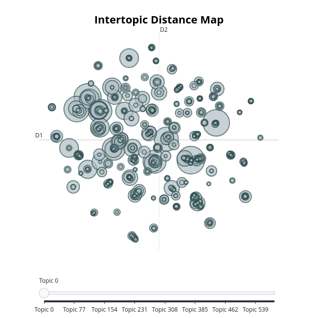

# Performance Assessment and Discussion

## Topic Modeling

Topic modeling was performed on the collection of books authored by Jane Austen using BERTopic with the transformer `all-MiniLM-L6-v2` embedding model. This  model is a lightweight version of the original BERT architecture that has been distilled and fine-tuned on a large corpus of text data. It efficiently generates semantically meaningful sentence embeddings that capture the contextual information necessary for downstream tasks like topic modeling.

The UMAP dimensionality reduction algorithm was applied to the sentence embeddings with `n_neighbors=15`, `n_components=3`, and `cosine` distance metric. This projects the high-dimensional embeddings into a more compact representation while preserving local neighborhood structure. Clusters were then identified in this low-dimensional space using the HDBSCAN algorithm with `min_cluster_size=5`, `Euclidean` distance metric, and Excess of Mass method for cluster selection.

To further optimize the topic model, KeyBERT-inspired techniques were used to improve stop word removal, ensuring the most salient words characterize each topic. The final BERTopic model was fit using `min_topic_size=50` to remove small, noisy topics and the top 3 most representative words were extracted for each topic.

The resulting model identified more than 500 distinct, semantically meaningful topics across Jane Austen's literary works. A detailed view of the results showed above: 

To further refine the topic model and uncover even more nuanced and meaningful topics, additional experimentation with hyperparameter tuning, custom pre-processing steps, and domain-specific keyword extraction techniques is warranted.

## Book Summary
